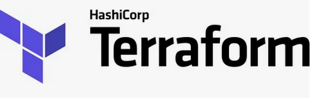
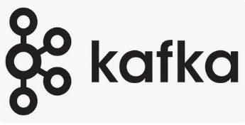

# Kafka-junior

1. Развертывание инфраструктуры в YC по средствам [Terraform](terraform/README.md)

2. Развертывание кластера kafka с предварительной настройкой в KRaft Mode с помощью [Ansible](ansible/README.md)

3. Развертываение [akhq-server](ansible/README.md#akhq)

4. Примеры работы адаптеров на [GO/Python/Java](/adapters/README.md)

---

  
  
  
  

